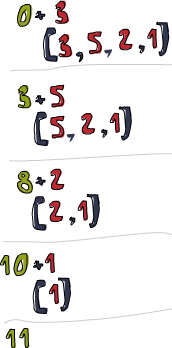

# 高阶函数

### 柯里化

柯里化（Currying），是指把接收多个参数的函数变换成一个接收单一参数的函数，并且返回接收余下参数而且返回结果的新函数的技术。

本质上，Haskell 的所有函数都只有一个参数，所有多个参数的函数都是柯里函数。

例如，`max`函数，以下两种调用方式完全等价：

```shell
ghci> max 4 5
5
ghci> (max 4) 5
5
```

当执行`max 4 5`时，它会返回一个函数，该函数接收一个参数并返回`4`或者该参数，具体取决于谁更大。

检查`max`函数的类型：

```shell
ghci> :t max
max :: Ord a => a -> a -> a
```

函数类型中的`->`仅用于分割参数和返回值的类型。

由此可以理解`max`函数取一个参数，并返回一个函数，这个函数再取一个参数，完成计算并返回最终结果。

#### 动机

柯里化是一种处理函数中附有多个参数的方法，并在只允许单一参数的框架中使用这些函数。例如，一些分析技术只能用于具有单一参数的函数。现实中的函数往往有更多的参数。

一些编程语言几乎总是使用柯里函数来实现多个参数，例如 Haskell。这个属性是从`lambda演算`继承而来的，其中多参数的函数通常以柯里形式表示。

#### 好处 - 不全调用

若以不全参数来调用，就可以得到一个不全调用的函数，这种方法可以很方便的构造新的函数。

```haskell
multThree :: Num a => a -> a -> a -> a
multThree x y z = x * y * z

-- 构造新函数
ghci> let multTwoWithNine = multThree 9
ghci> multTwoWithNine 2 3
54
ghci> let multWithEighteen = multTwoWithNine 2
ghci> multWithEighteen 10
180
```

中缀函数也可以不全调用，只需要用括号把它和一边的参数括在一起即可：

```haskell
divideByTen :: Floating a => a -> a
divideByTen = (/10)
ghci> divideByTen 200  -- 等价于：(/10) 200、200 / 10
20

isUpperAlphanum :: Char -> Bool
isUpperAlphanum = (`elem` ['A' .. 'Z'])
ghci> isUpperAlphanum 'a' -- 等价于：'a' `elem` ['A' .. 'Z']
False
```

> `-`运算符是唯一的例外，无法做不全调用。处于计算上的方便，如`(-4)`表示负`4`。如果需要减法的不全调用可以使用`subtract`函数。

### 高阶函数

高阶函数是指能接收一个或多个函数作为输入，或者将函数作为输出的函数。

#### 函数作为参数

取一个函数并调用它两次：

```haskell
applyTwice :: (a -> a) -> a -> a
applyTwice f x = f (f x)


ghci> applyTwice (+3) 10
16
ghci> applyTwice (++ " HAHA") "HEY"
"HEY HAHA HAHA"
ghci> applyTwice (3:) [1]
[3,3,1]
```

如果函数需要接收一元函数，可以不全调用一个函数让它剩一个参数，再将它传进去。

#### 函数作为返回值

取一个函数作为参数并返回一个相似的函数，只是它们的两个参数倒了个：

```haskell
flip' :: (a -> b -> c) -> (b -> a -> c)
flip' f x y = f y x

ghci> flip' zip [1,2,3,4,5] "hello"
[('h',1),('e',2),('l',3)]
```

#### map 与 filter

map 取一个函数和 List 做参数，遍历该 List 的每个元素来调用该函数产生一个新的 List。

```haskell
map' :: (a -> b) -> [a] -> [b]
map' _ [] = []
map' f (x:xs) = f x : map' f xs

ghci> map' (+3) [1, 2, 3]
[4,5,6]
ghci> map' (++ "!") ["BIFF", "BANG", "POW"]
["BIFF!", "BANG!", "POW!"]
ghci> map' (replicate 3) [3..6]
[[3,3,3],[4,4,4],[5,5,5],[6,6,6]]
```

filter 取一个限制条件和 List 做参数，返回该 List 中所有符合该条件的元素。

```haskell
filter' :: (a -> Bool) -> [a] -> [a]
filter' _ [] = []
filter f (x:xs)
  | f x = x : filter f xs
  | otherwise filter f xs

ghci> filter' (>3) [1, 5, 3, 2, 1]
[5]
ghci> filter' even [1..10]
[2,4,6,8,10]
ghci> let notNull x = not (null x) in filter' notNull [[1,2,3], [], [2,2], [], []]
[[1,2,3], [2,2]]
```

无论是 map 还是 filter 都可以使用列表推导来实现，并没有教条规定必须在什么情况下使用 map 和 filter 还是列表推导。如果有多个限制条件，只能连着嵌套几个 filter 或用 && 等逻辑函数组合之，这时就不如列表推导来得优雅了。

### lambda

lambda 即匿名函数。

定义 lambda 需要使用`\`开头（因为它看起来像是希腊字母的 lambda），然后是用空格分隔的参数，最后是`->`后面的函数体。

```haskell
ghci> filter (\xs -> length xs > 2) [[1], [2, 3, 4], [5, 6]]
[2,3,4]
```

通常 lambda 都会用括号括起，否则它就会将`->`右边的部分都视为函数体。

和普通函数一样，lambda 可以取多个参数：

```shell
ghci> zipWith (\a b -> (a * 30 + 3) / b) [5, 4, 3, 2, 1] [1, 2, 3, 4, 5]
[153.0,61.5,31.0,15.75,6.6]
```

也可以使用模式匹配：

```shell
ghci> map (\(a, b) -> a + b) [(1, 2), (3, 4)]
[3, 7]
```

需要注意的是 lambda 中使用模式匹配，无法为一个参数设置多个模式，如`[]`和`(x:xs)`。匹配若失败，则会抛出一个运行时错误。

lambda 是一个表达式，它会回传一个函数。

```haskell
flip' :: (a -> b -> c) -> (b -> a -> c)
flip' f = \x y = f y x
```

### $函数

`$`函数也叫函数调用符。

```haskell
($) :: (a -> b) -> a -> b
f $ x = f x
```

普通的函数调用符有最高的优先级，而`$`的优先级最低。用空格的函数调用符是左结合的，如`f a b c`与`((f a) b) c`等价。而`$`是右结合的，`((f a) b) c`与`f a $ b $ c`等价。

使用`$`可以减少代码中括号的数目。如表达式`sum (filter (> 10) (map (*2) [2..10]))`，可以将其改写为`sum $ filter (>10) $ map (*2) [2..10]`。

除了减少括号外，`$`还可以将数据作为函数使用。例如映射一个函数调用符到一个函数 List：

```shell
ghci> map ($ 3) [(4+), (10*), (^2), sqrt]
[7.0,30.0,9.0,1.7320508075688772]
```

### 折叠

处理 List 的许多函数都有固定的模式，将边界条件设置为空 List，引入`(x:xs)`模式，对单个元素和余下的 List 进行操作。

这一模式十分常见，因此 Haskell 引入了一组函数来使之简化，也就是`fold`（折叠）。

`fold`取一个二元函数，一个累加值（初始值）和一个需要折叠的 List。这个二元函数有两个参数，即累加值和 List 的首项（或尾项），回传值是新的累加值。然后，以新的累加值和新的 List 首项调用该函数，如是继续，直到 List 遍历完毕，只剩下一个累加值，也就是最终的结果。

`foldl`函数，也叫左折叠，从 List 的左端开始。例如，sum 函数实现：

```haskell
sum' :: (Num a) => [a] -> a
sum' xs = foldl (\acc x -> acc + x) 0 xs
-- sum' xs = foldl (+) 0 xs

ghci> sum' [3, 5, 2, 1]
11
```

折叠执行过程：



右折叠`foldr`的行为与左折叠相似，从 List 的右端开始。

```haskell
map' :: (a -> b) -> [a] -> [b]
map' f xs = foldr (\x acc -> f x : acc) [] xs
```

右折叠的二元函数首个参数为当前值，左折叠的是累加值。右折叠可以处理无限长度的数据结构，左折叠不可以。

#### foldl1 与 foldr1

`foldl1`与`foldr1`的行为与`foldl`和`foldr`相似，只是不需要提供初始值，默认取 List 的首项(或尾项)作为初始值。

```haskell
sum' :: (Num a) => [a] -> a
sum' xs = foldl1 (+)

product' :: (Num a) => [a] -> a
product' foldr1 (*)
```

#### scanl 与 scanr

`scanl`和`scanr`与`foldl`和`foldr`相似，只是它们会记录累加值的所有状态到一个 List。也有`scanl1`和`scanr1`。

```shell
ghci> scanl (+) 0 [3, 5, 2, 1]
[0,3,8,10,11]
ghci> scanr (+) 0 [3, 5, 2, 1]
[11,8,3,1,0]
ghci> scanl1 (\acc x -> if x > acc then x else acc) [3, 4, 5, 3, 7, 9, 2, 1]
[3,4,5,3,7,9,9,9]
```

使用`scan`可以追踪`fold`函数的执行过程。

### 组合

在数学中，函数组合是这样定义的：


表示组合两个函数成为一个函数，以`x`调用这一函数，就与用`x`调用`g`再用所得的结果调用`f`等价。

Haskell 中的函数组合与之很像，即`.`函数。

```haskell
(.) :: (b -> c) -> (a -> b) -> a -> c
f . g = \x -> f (g x)
```

`.`函数的类型声明中，`f`的参数必须`g`的回传类型相同。

函数组合的作用就是生成新的函数。

例如，将一个数字 List 中的元素全部转换为负数：

```shell
# 使用 lambda
ghci> map (\x -> negate (abs x)) [5, -3, -6, 7, -3, 2, -19, 24]
[-5,-3,-6,-7,-3,-2,-19,-24]

# 使用组合
ghci> map (negate . abs) [5, -3, -6, 7, -3, 2, -19, 24]
[-5,-3,-6,-7,-3,-2,-19,-24]
```

组合的函数是多个参数的函数，可以使用不全调用使每个函数都只剩下一个参数。

```shell
ghci> sum (replicate 5 (max 6.7 8.9))

# 使用组合
ghci> sum . replicate 5 . max 6.7 $ 8.9
```

### Point Free

Point Free 是一种编程风格，指函数定义不标识所要操作的参数，只是和其他函数的复合。也可以理解为，不使用要处理的值，只合成运算过程。

例如：

```haskell
addOne x = x + 1
square x = x * x

addOneThenSquare = addOne . square
ghci> addOneThenSquare 2
5
```

`addOneThenSquare`是一个合成函数，在定义它时，根本不需要提到要处理的值，这就是 Point Free。

Point Free 的本质就是使用一些通用的函数，组合出各种复杂的运算。上层运算不直接操作数据，而是通过底层函数去处理。

它的好处是，运算过程抽象化，处理一个值，但是不提到这个值。能让代码更加清晰简练，更符合语意，更容易复用、测试。但需要注意的是，用好 Point Free 最先要做的，是为函数起一个通俗易懂的名字，通过名字就能知道函数的功能不用去深入函数细节。
